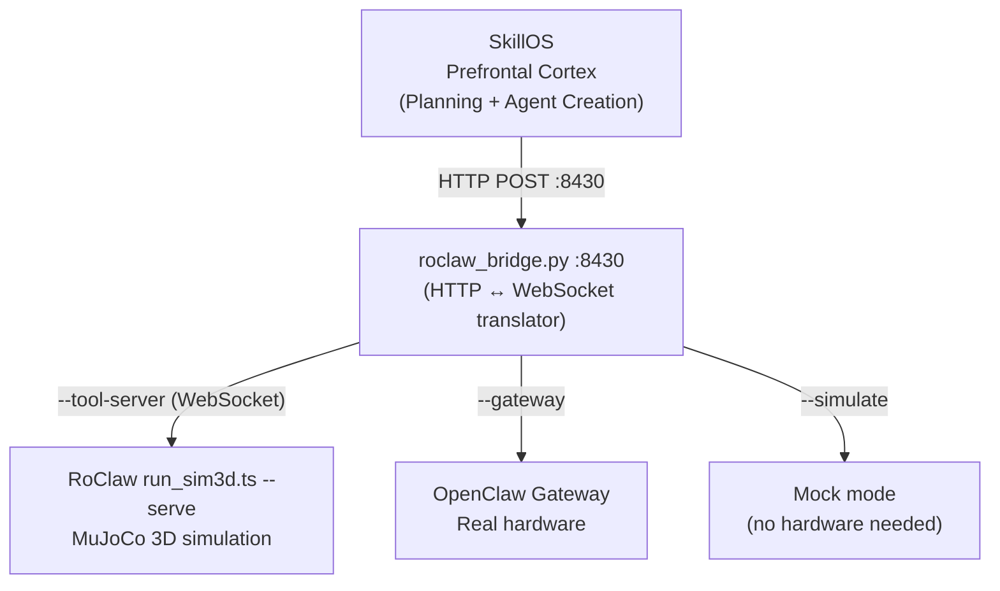

# Physical Robot Integration — RoClaw

SkillOS serves as the **Prefrontal Cortex** for the RoClaw physical robot, providing high-level planning, reasoning, and dynamic agent creation. Together with RoClaw, it forms a two-component cognitive architecture:

| Component | Brain Region | Role | Repository |
|-----------|-------------|------|------------|
| **SkillOS** | Prefrontal Cortex | Planning, reasoning, dynamic agent creation, dream consolidation | [skillos-unified](https://github.com/rdave666/skillos-unified) |
| **RoClaw** | Cerebellum | VLM motor control, reactive navigation, trace emitter | [RoClaw](https://github.com/EvolvingAgentsLabs/RoClaw) |

SkillOS communicates with RoClaw over HTTP via `roclaw_bridge.py`. Dream consolidation and strategy memory are stored as local `.md` trace files in `projects/RoClaw/memory/`.

---

## Architecture



**roclaw_bridge.py** is the translation layer — it accepts HTTP REST calls from SkillOS (or any runtime) and forwards them as WebSocket tool invocations to the robot backend. Any runtime (Claude Code, Qwen, curl) can control the robot identically.

---

## Robot Skills

All robot skills live under `system/skills/robot/` and extend `robot/base.md`, which provides shared cognitive behaviors.

### roclaw-navigation-agent

Route planning and physical navigation execution.

```
Domain: robot / family: navigation
Invoke when: "go to [location]", "navigate to", "move to", "find path"
```

**Capabilities:**
- Multi-room route planning with obstacle avoidance
- Dynamic re-routing when obstacles block the path
- Recovery strategies for stuck states (stall detection)
- Trace logging with fidelity tagging for dream consolidation
- Querying local strategy memory before planning new routes

**Example:**
```bash
skillos execute: "Navigate to the kitchen and pick up the red object"
```

### roclaw-scene-analysis-agent

VLM-based camera feed analysis and semantic mapping.

```
Domain: robot / family: scene
Invoke when: "what do you see", "describe scene", "identify objects", "build map"
```

**Capabilities:**
- Real-time scene interpretation from robot camera feed
- Object identification and spatial relationship mapping
- Semantic map building (room → objects → positions)
- Environmental classification (kitchen, hallway, obstacle field)
- Anomaly detection (unexpected objects blocking routes)

**Example:**
```bash
skillos execute: "Describe what the robot sees and identify any obstacles"
```

### roclaw-dream-agent

Bio-inspired dream consolidation cycle management. Reads local trace files and writes consolidated strategies and negative constraints back to `projects/RoClaw/memory/long_term/`.

```
Domain: robot / family: dream
Invoke when: "dream consolidation", "learn from today", "consolidate navigation"
```

**Capabilities:**
- SWS (Slow-Wave Sleep) — trace curation and deduplication
- REM phase — chunking traces into reusable strategy patterns
- Consolidation — writing patterns to `strategies.md` and `negative_constraints.md`
- Extracting Negative Constraints from failed navigation attempts
- Evolving navigation strategies based on accumulated experience

**Example:**
```bash
skillos execute: "Trigger dream consolidation for today's navigation sessions"
```

---

## Robot Tools

### roclaw-tool

HTTP bridge to RoClaw's robot tools.

```
Domain: robot / family: tools
Maps to: HTTP POST to roclaw_bridge.py :8430
```

**Available Robot Tools:**

| Tool | Description | Parameters |
|------|-------------|------------|
| `robot.go_to` | Navigate to a named location | `location: string` |
| `robot.explore` | Autonomous exploration of an area | `area: string` |
| `robot.describe_scene` | VLM description of current camera feed | — |
| `robot.stop` | Immediate halt | — |
| `robot.status` | Current pose, battery, stall state | — |
| `robot.read_memory` | Query local strategy memory | `query: string` |
| `robot.record_observation` | Log an observation to local memory | `observation: string` |
| `robot.analyze_scene` | Deep scene analysis with object detection | — |
| `robot.get_map` | Return the current semantic map | — |
| `robot.telemetry` | Live telemetry: pose (x, y, heading), wheel velocities | — |

`robot.read_memory` and `robot.record_observation` read from and write to `projects/RoClaw/memory/` — no external server required.

---

## Trace Fidelity

All robot actions are tagged with a fidelity level. The dream agent weights consolidation by fidelity — real-world experiences matter more than simulated ones.

| Fidelity Tag | Weight | Source |
|-------------|--------|--------|
| `REAL_WORLD` | 1.0 | Actual hardware |
| `SIM_3D` | 0.8 | MuJoCo physics simulation |
| `SIM_2D` | 0.5 | virtual_roclaw kinematics |
| `DREAM_TEXT` | 0.3 | Text-only dream scenarios |

---

## Quick Start

### Simulation Mode (no hardware required)

```bash
# Terminal 1: Start the bridge in mock mode
python roclaw_bridge.py --port 8430 --simulate

# Terminal 2: Run a navigation goal
claude --dangerously-skip-permissions \
  "skillos execute: 'Navigate to the kitchen and describe what you see'"
```

### With MuJoCo 3D Simulation

```bash
# Terminal 1: Start 3D simulation
cd path/to/roclaw && npx ts-node run_sim3d.ts --serve

# Terminal 2: Start bridge connected to sim
python roclaw_bridge.py --port 8430 --tool-server ws://localhost:8765

# Terminal 3: Execute
claude --dangerously-skip-permissions \
  "skillos execute: 'Explore the house and build a semantic map'"
```

### With Real Hardware

```bash
# Terminal 1: Start bridge connected to OpenClaw Gateway
python roclaw_bridge.py --port 8430 --gateway ws://robot.local:8765

# Terminal 2: Execute
claude --dangerously-skip-permissions \
  "skillos execute: 'Navigate to the office and pick up the package'"
```

### Direct Tool Access (curl)

```bash
# Navigate
curl -s -X POST http://localhost:8430/tool/robot.go_to \
  -H "Content-Type: application/json" \
  -d '{"location": "kitchen"}'

# Get live telemetry
curl -s http://localhost:8430/tool/robot.telemetry

# Describe scene
curl -s -X POST http://localhost:8430/tool/robot.describe_scene
```

---

## Dream Consolidation Cycle

The dream cycle runs after navigation sessions to consolidate experiences into reusable strategies. Results are written to local `.md` files — no external server required.

```
Execution traces logged (fidelity-tagged)
          ↓
SWS Phase — Slow-Wave Sleep
  Curate traces: remove duplicates, fix errors
  Score trace quality
          ↓
REM Phase — Rapid Eye Movement
  Chunk traces into strategy patterns
  Identify common sub-sequences
          ↓
Consolidation Phase
  Write patterns → projects/RoClaw/memory/long_term/strategies.md
  Extract Negative Constraints → negative_constraints.md
  Update strategy confidence scores
          ↓
Next navigation reads local strategy memory first
  → Uses learned strategies instead of replanning from scratch
```

### Triggering a Dream

```bash
# Via SkillOS
skillos execute: "Trigger dream consolidation for robotics domain"

# Via Qwen runtime
python agent_runtime.py "trigger dream consolidation"
```

---

## Dynamic Robot Agent Creation

The key advantage of SkillOS over a static robot controller is **runtime agent creation**. When the robot encounters a novel situation:

1. `roclaw-navigation-agent` detects a failure it cannot handle (e.g., robot stuck on rug)
2. Analyzes the scene via `roclaw-scene-analysis-agent`
3. Creates a new recovery skill as markdown: `RugRecoveryTool.md`
4. Executes the recovery strategy using the new skill
5. Logs the experience for dream consolidation
6. Next time: the strategy is in local memory and doesn't need to be re-invented

The robot gains new capabilities **at runtime** — no firmware update, no redeployment.

---

## Full End-to-End Scenario

A complete RoClaw integration demo is available at `scenarios/RoClaw_Integration.md`:

```bash
skillos execute: "Run the RoClaw Integration scenario"
```

This scenario demonstrates:
1. Boot SkillOS with robot connection
2. Query local strategy memory for known routes
3. Navigate to target location
4. Describe and map the scene
5. Log trace with fidelity tagging
6. Trigger dream consolidation
7. Verify strategy memory was updated
